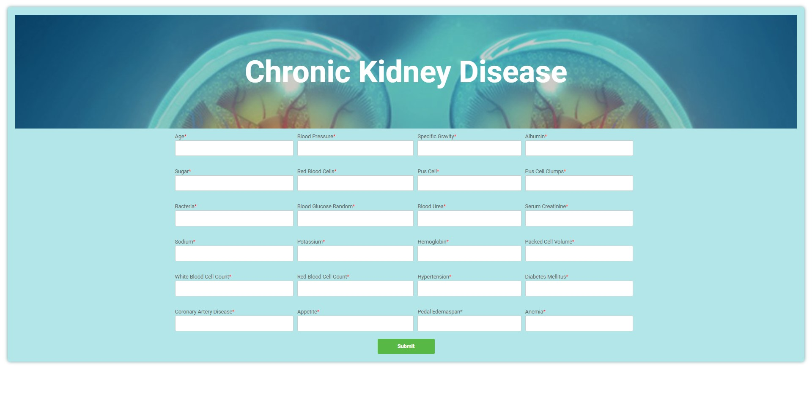

# CKD-web-site-to-predict

This is a research based project where we have used different algorithms to find the best one for predicting the Chronic Kidney Disease.

Here XGBoost performed the best result with accuracy of 98.55%. 

I made a web interface using one of the best performed algorithm named Logistic Regression.
 
Here the accuraccy was 84.84%.

Pease find th evisual site of the web interface.

### Input site

### Output result

